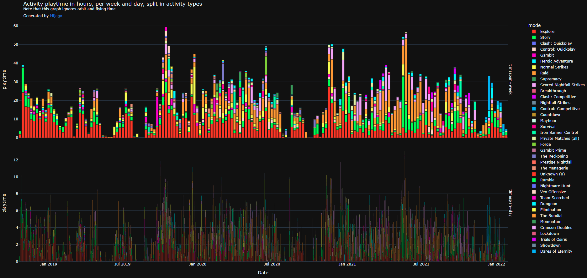
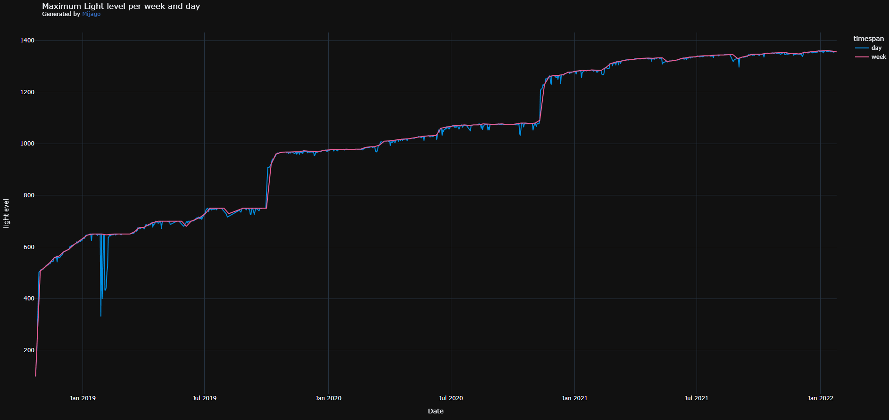
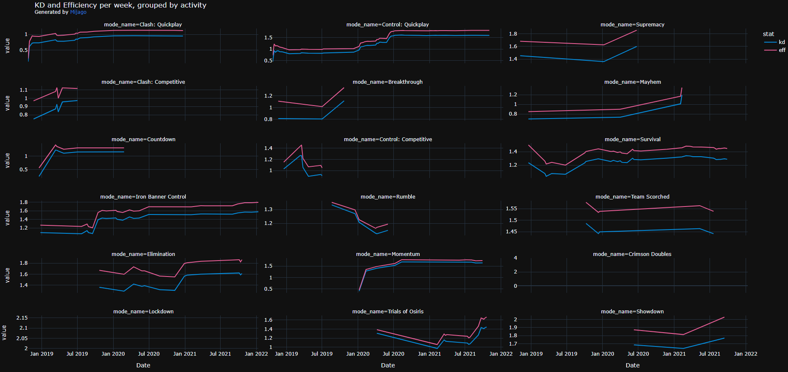
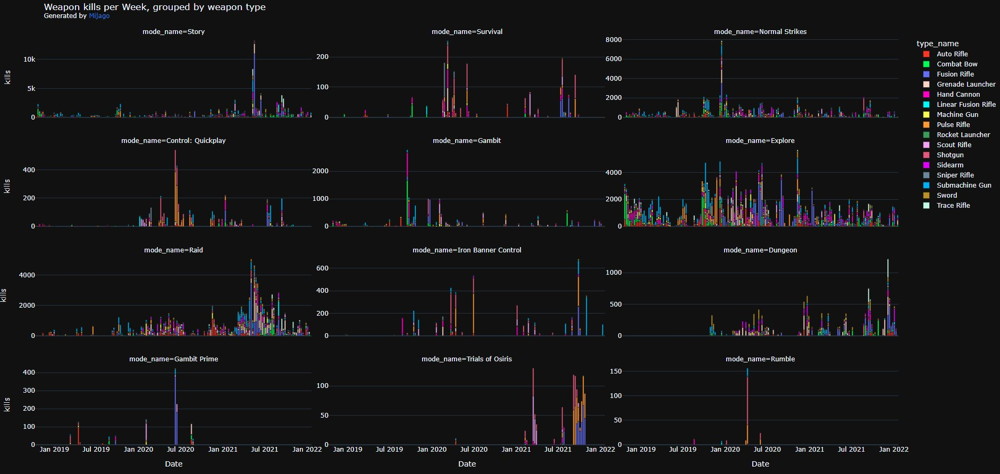

# What is this?
This downloads all your PGCRs (Post Game Carnage Report) from the Bungie.net api and builds some graphs.
If you find a bug when you run it locally, feel free to open an issue and I'll look at it - I don't really give support for this, though.
I'll add some more charts over time!

Make sure to post your cool charts on Twitter and to mention me on them! 
I'd love to see what all of you get to see! 
My Twitter: https://twitter.com/MijagoCoding/

# How to Use?
3) Install all required packages
   1) `python -m pip install pandas plotly pathos requests pretty_html_table bar-chart-race`
   2) If you want to use mp4 instead of gif, also install `python -m pip python-ffmpeg` and put a [ffmpeg](https://www.ffmpeg.org/download.html) executable in your PATH variable. Then set the `VIDEO_TYPE` in `main.py` to `mp4`. **I highly encourage you to do this**.
4) Add your api key to `main.py`. For this, edit `api = BungieApi("API-KEY")`.
5) Edit your user info in `main.py`.
   ```py
   MEMBERSHIP_MIJAGO = (3, 4611686018482684809)
   MEMBERSHIP_MYCOOLID = (1, 1231231231231233353) # for example, add this
   USED_MEMBERSHIP = MEMBERSHIP_MYCOOLID
   api = BungieApi("API-KEY")
   ```
6) Run! `python3 main.py`
   1) May take a while. I need 35~45 seconds for 1000 PGCRs with a download speed of 4.5mb/s.

# Where do I get my user ID?
1) Go to https://www.d2checklist.com (or any other similar page)
2) Search for your user, open your page
3) Look at the URL: `https://www.d2checklist.com/3/4611686018482684809/milestones`
   In this case, `3` is your MEMBERSHIP_TYPE and `4611686018482684809` is the MEMBERSHIP_ID, so you'll do something like `MEMBERSHIP_MIJAGO = (3, 4611686018482684809)`.


# Known Issues
- Sometimes the PGCR-Download is stuck. This is an issue with the threading library. Just restart the whole script. This is not a big issue as it continues where it stopped.

# Examples
These examples are from the early stage:







